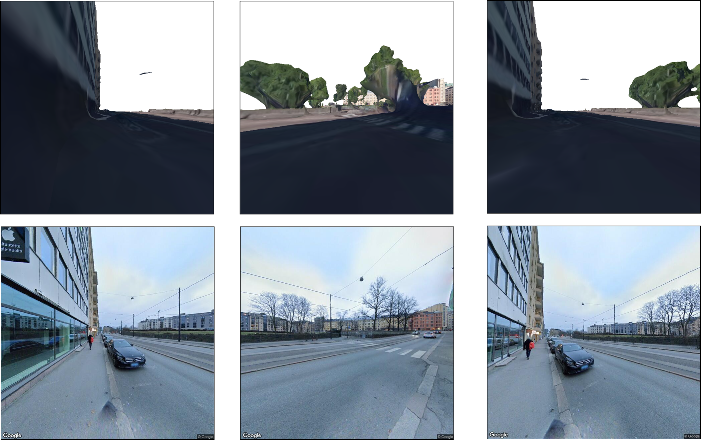

# Implicit Neural Representations for Large-scale Remote Sensing Scene

<!-- ABOUT THE PROJECT -->
## About The Project
(https://shadowxzt.github.io/Implicit-remote-sensing-scene.github.io/)

Remote sensing imagery, captured from top-view, can cover a large range of visual content. However, compared with ground-view data, they usually lack some informative details of the scene. In this context, recent progress on neural rendering and implicit neural representation makes the photorealistic cross-view synthesis possible by predicting the ground-view image given the top-view data. Cross-view synthesis enables the scene understanding from remote sensing and street views. Many applications can benefit from this task, including autonomous driving and navigation. Moreover, view synthesis between ground-view to top-view also bridges the gap between computer vision and remote sensing community and extends the application areas of remote sensing methods.

<p align="right">(<a href="#top">back to top</a>)</p>


<div  align="center">    
 
</div>

<!-- GETTING STARTED -->
## Getting Started
The annotation tool can be accessed by the following link:
[Download Page](./product/download.html)

### Prerequisites

1. First, run the following script to connect the the annotation server
  ```sh
  Windows PowerShell
  ```
  
2. Then， run the following script in the powershell terminal:
 ```sh
 ssh -L localhost:8002:172.17.0.3:8000 xshadow@AI4EO2.sipeo.lrg.tum.de
 ```
3. Finally, open a browser and use an account to log into the annotation system:
 * ```python
   localhost:8002
   ```
   The following accounts are avaliable now:
   ```python
   username: user1  passwd: user1
   username: user2  passwd: user2
   ```
### Annotation
1. Get a free API Key at [https://example.com](https://example.com)
2. Clone the repo
   ```sh
   git clone https://github.com/your_username_/Project-Name.git
   ```
3. Install NPM packages
   ```sh
   npm install
   ```
4. Enter your API in `config.js`
   ```js
   const API_KEY = 'ENTER YOUR API';
   ```

<p align="right">(<a href="#top">back to top</a>)</p>


<!-- CONTACT -->
## Contact

Zhitong Xiong - zhitong.xiong@tum.de

Project Link: [https://github.com/your_username/repo_name](https://github.com/your_username/repo_name)

<p align="right">(<a href="#top">back to top</a>)</p>

## Problem statement:
Assume that we have got a 3D city model, which can be reconstructed by MVS from multiple satellite images. Given the 3D model and street-view images at several locations, we aim to render novel views at other locations continuously.

## Data description:
*	Top view satellite image. The red dot indicates the location for capturing the street view images.
*	The corresponding 3D city model (mesh and texture), with pixel-wise segmentation annotations. Georeferenced to the top-view image and street view images.
*	The corresponding street view images at coordinate (6063,4597) of the 3D model. The filenames of these images indicate the camera poses (location, pitch, fov and heading). 
*	The corresponding 360 street view image
*	Illustration of an initial idea on novel street view synthesis.

In Data_sample/panos.txt:

        Pano_ID,              Lat,               Lon,          Y in 3D model,     X in 3D model
  
        AXD-LhS8HF3v1XajBnV2nA, 60.1644797333783, 24.92898345052589, 4400.232103129849,  6056.963851299137

Pano_ID can be used to download the street view image;
Lat and Lon can be used to download the Street view image or the top-view satellite image
X and Y can be used to locate in the 3D mesh model and render the synthetic image


Mesh_render.py is a sample code for rendering the synthetic image. Using the street view API, we can get the corresponding real image.


