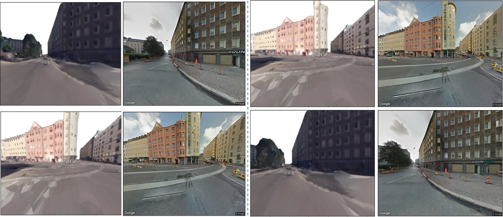

# Implicit Neural Representations for Large-scale Remote Sensing Scene

<!-- ABOUT THE PROJECT -->
## About The Project
(https://shadowxzt.github.io/Implicit-remote-sensing-scene.github.io/)

Remote sensing imagery, captured from top-view, can cover a large range of visual content. However, compared with ground-view data, they usually lack some informative details of the scene. In this context, recent progress on neural rendering and implicit neural representation makes the photorealistic cross-view synthesis possible by predicting the ground-view image given the top-view data. Cross-view synthesis enables the scene understanding from remote sensing and street views. Many applications can benefit from this task, including autonomous driving and navigation. Moreover, view synthesis between ground-view to top-view also bridges the gap between computer vision and remote sensing community and extends the application areas of remote sensing methods.

<p align="right">(<a href="#top">back to top</a>)</p>


<div  align="center">    
 
</div>


### Built With

This section should list any major frameworks/libraries used to bootstrap your project. Leave any add-ons/plugins for the acknowledgements section. Here are a few examples.

* [Next.js](https://nextjs.org/)
* [React.js](https://reactjs.org/)
* [Vue.js](https://vuejs.org/)

<p align="right">(<a href="#top">back to top</a>)</p>


<!-- GETTING STARTED -->
## Getting Started

This is an example of how you may give instructions on setting up your project locally.
To get a local copy up and running follow these simple example steps.

### Prerequisites

This is an example of how to list things you need to use the software and how to install them.
* npm
  ```sh
  npm install npm@latest -g
  ```

### Installation

_Below is an example of how you can instruct your audience on installing and setting up your app. This template doesn't rely on any external dependencies or services._

1. Get a free API Key at [https://example.com](https://example.com)
2. Clone the repo
   ```sh
   git clone https://github.com/your_username_/Project-Name.git
   ```
3. Install NPM packages
   ```sh
   npm install
   ```
4. Enter your API in `config.js`
   ```js
   const API_KEY = 'ENTER YOUR API';
   ```

<p align="right">(<a href="#top">back to top</a>)</p>


<!-- USAGE EXAMPLES -->
## Usage

Use this space to show useful examples of how a project can be used. Additional screenshots, code examples and demos work well in this space. You may also link to more resources.

_For more examples, please refer to the [Documentation](https://example.com)_

<p align="right">(<a href="#top">back to top</a>)</p>


<!-- ROADMAP -->
## Roadmap

- [x] Add Changelog
- [x] Add back to top links
- [ ] Add Additional Templates w/ Examples
- [ ] Add "components" document to easily copy & paste sections of the readme
- [ ] Multi-language Support
    - [ ] Chinese
    - [ ] Spanish

See the [open issues](https://github.com/othneildrew/Best-README-Template/issues) for a full list of proposed features (and known issues).

<p align="right">(<a href="#top">back to top</a>)</p>


<!-- CONTRIBUTING -->
## Contributing

Contributions are what make the open source community such an amazing place to learn, inspire, and create. Any contributions you make are **greatly appreciated**.

If you have a suggestion that would make this better, please fork the repo and create a pull request. You can also simply open an issue with the tag "enhancement".
Don't forget to give the project a star! Thanks again!

1. Fork the Project
2. Create your Feature Branch (`git checkout -b feature/AmazingFeature`)
3. Commit your Changes (`git commit -m 'Add some AmazingFeature'`)
4. Push to the Branch (`git push origin feature/AmazingFeature`)
5. Open a Pull Request

<p align="right">(<a href="#top">back to top</a>)</p>


<!-- LICENSE -->
## License

Distributed under the MIT License. See `LICENSE.txt` for more information.

<p align="right">(<a href="#top">back to top</a>)</p>


<!-- CONTACT -->
## Contact

Your Name - [@your_twitter](https://twitter.com/your_username) - email@example.com

Project Link: [https://github.com/your_username/repo_name](https://github.com/your_username/repo_name)

<p align="right">(<a href="#top">back to top</a>)</p>

## Problem statement:
Assume that we have got a 3D city model, which can be reconstructed by MVS from multiple satellite images. Given the 3D model and street-view images at several locations, we aim to render novel views at other locations continuously.

## Data description:
*	Top view satellite image. The red dot indicates the location for capturing the street view images.
*	The corresponding 3D city model (mesh and texture), with pixel-wise segmentation annotations. Georeferenced to the top-view image and street view images.
*	The corresponding street view images at coordinate (6063,4597) of the 3D model. The filenames of these images indicate the camera poses (location, pitch, fov and heading). 
*	The corresponding 360 street view image
*	Illustration of an initial idea on novel street view synthesis.

In Data_sample/panos.txt:

        Pano_ID,              Lat,               Lon,          Y in 3D model,     X in 3D model
  
        AXD-LhS8HF3v1XajBnV2nA, 60.1644797333783, 24.92898345052589, 4400.232103129849,  6056.963851299137

Pano_ID can be used to download the street view image;
Lat and Lon can be used to download the Street view image or the top-view satellite image
X and Y can be used to locate in the 3D mesh model and render the synthetic image


Mesh_render.py is a sample code for rendering the synthetic image. Using the street view API, we can get the corresponding real image.


